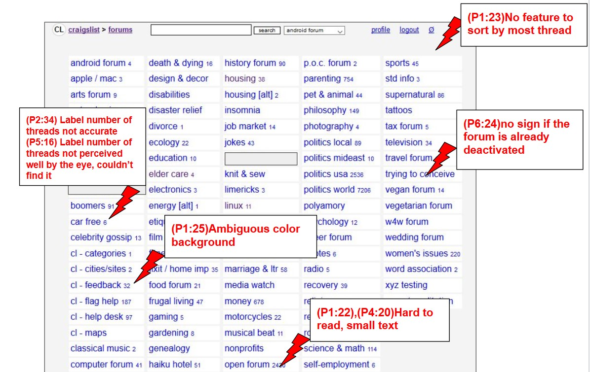
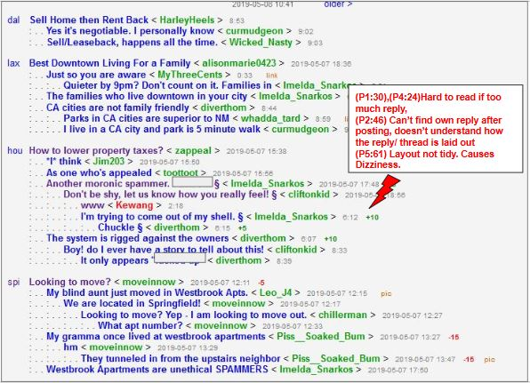
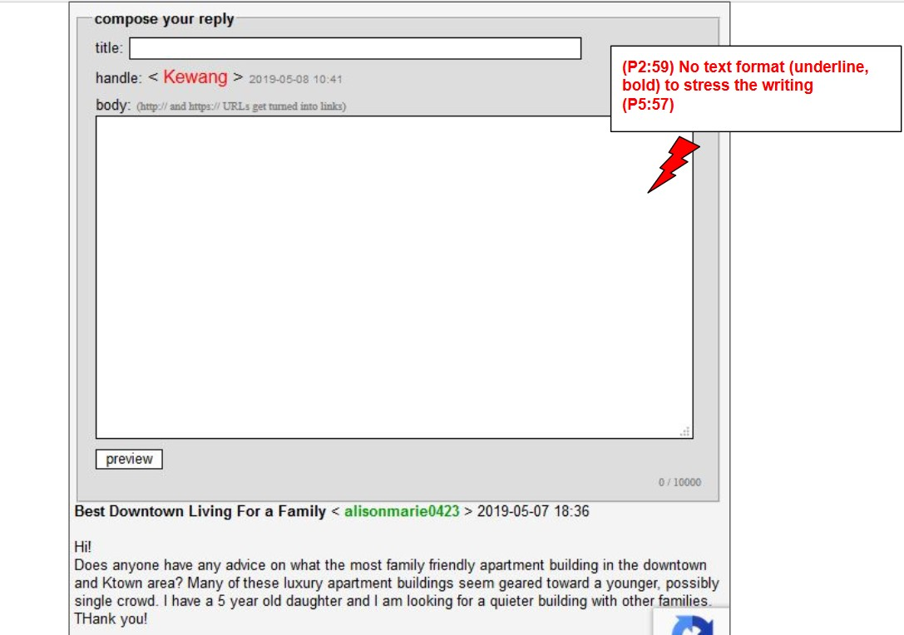
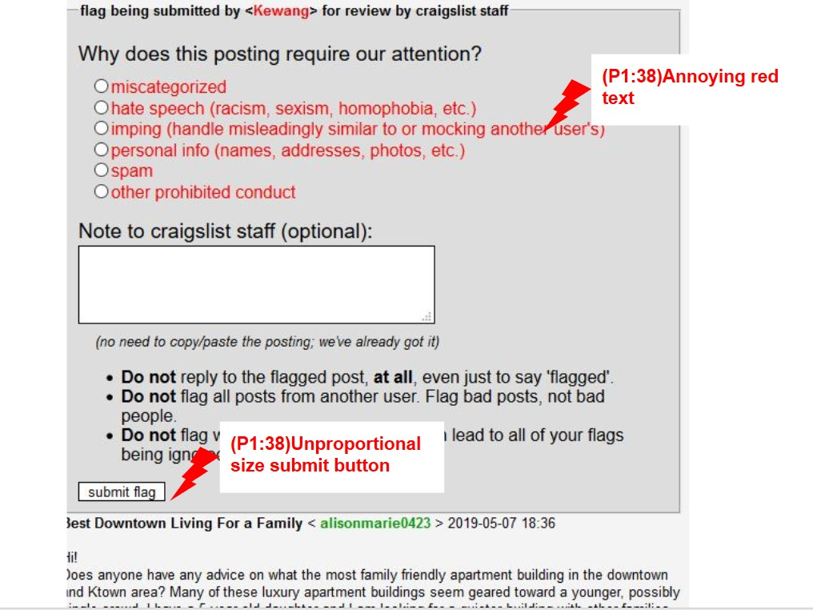
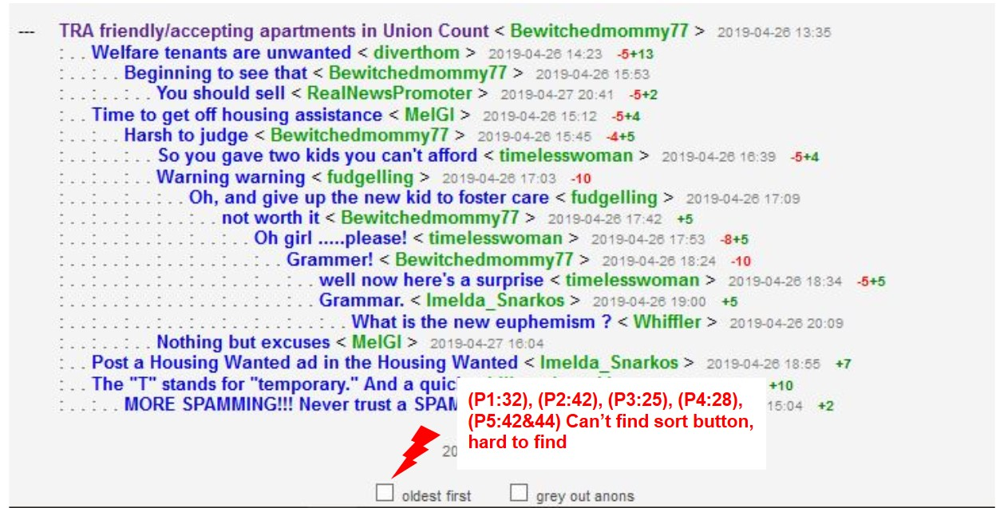
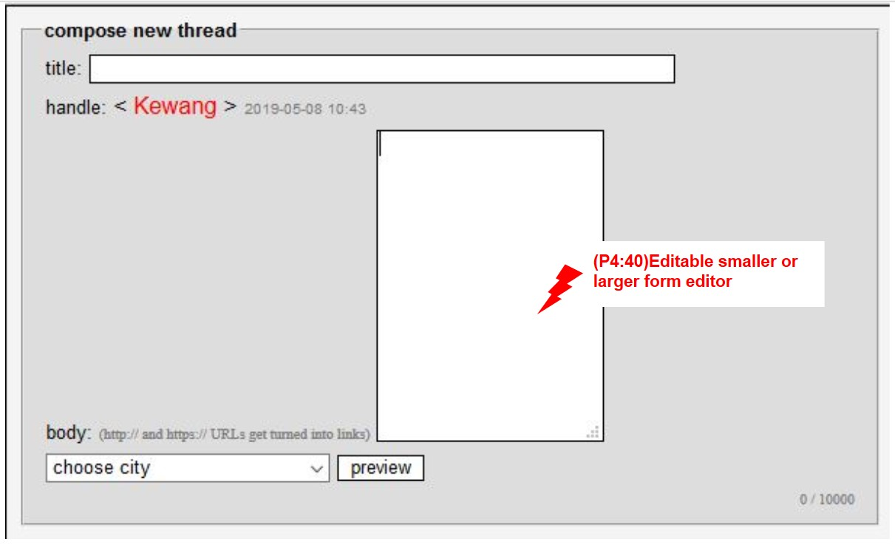
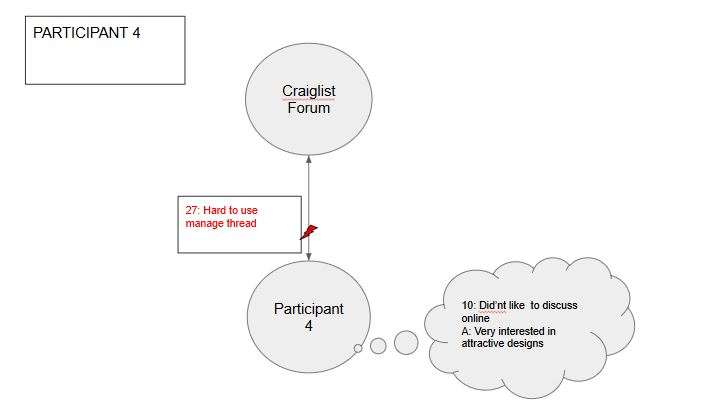

## Contextual Analysis
### Artifact Model

### Flow Model
#### Participant 1

#### Participant 2

#### Participant 3

#### Participant 4

#### Participant 5

#### Participant 6

### Cultural Model
#### Participant 1

#### Participant 2

#### Participant 3

#### Participant 4

#### Participant 5

#### Participant 6

## Do's And Don't
### Do
- Do give attractive scheme
- Give warning about illicit content, because illicit content is not inclusive. Users vary of all ages
- Be consistent
- Make a good and visible UI 
### Don't
- Don't use small font size for important information
