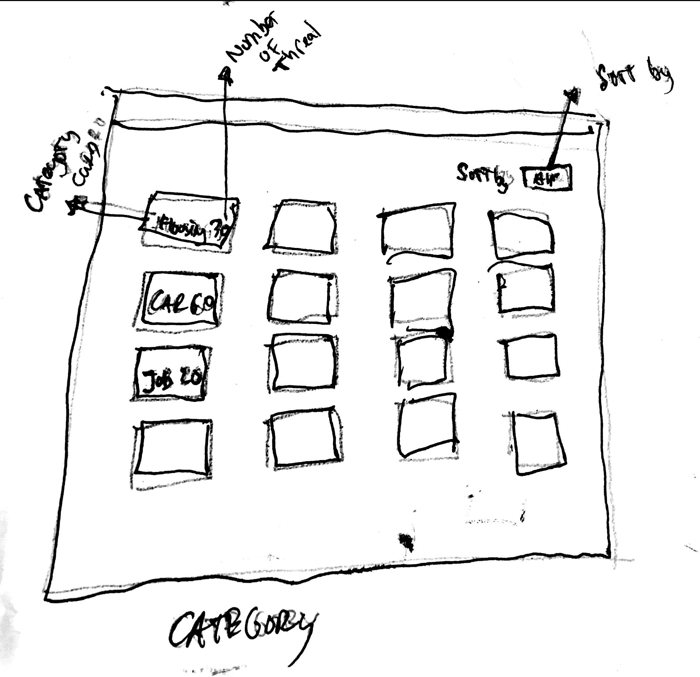
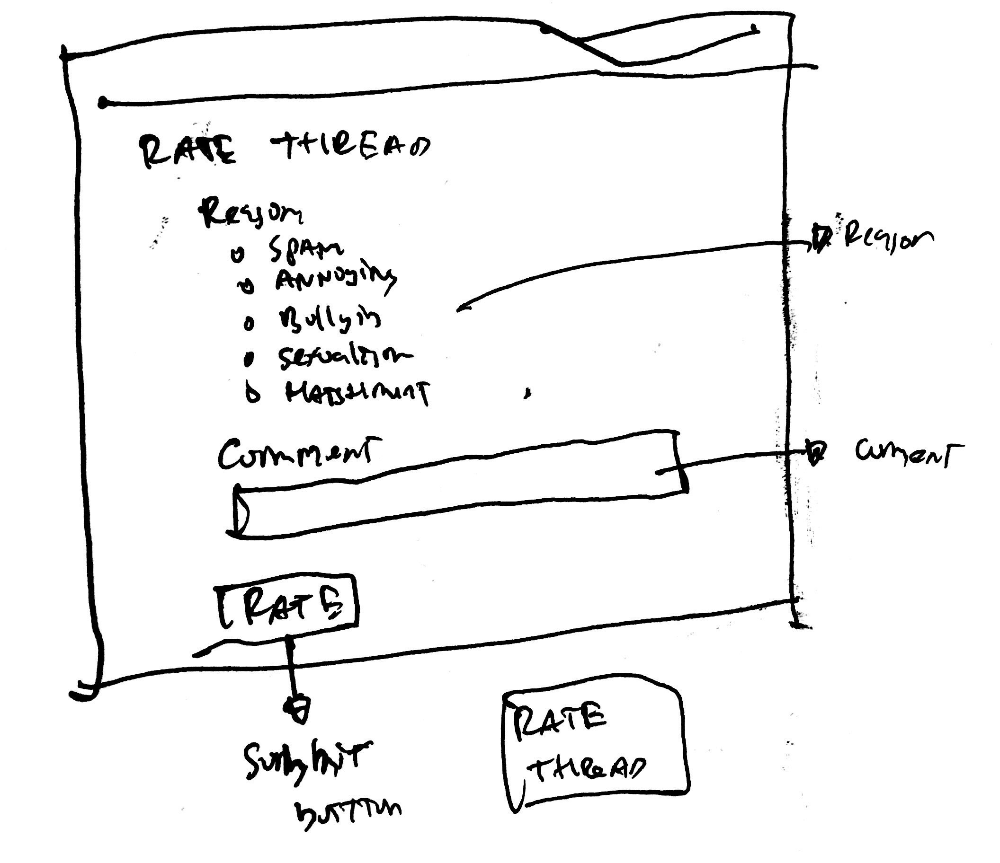
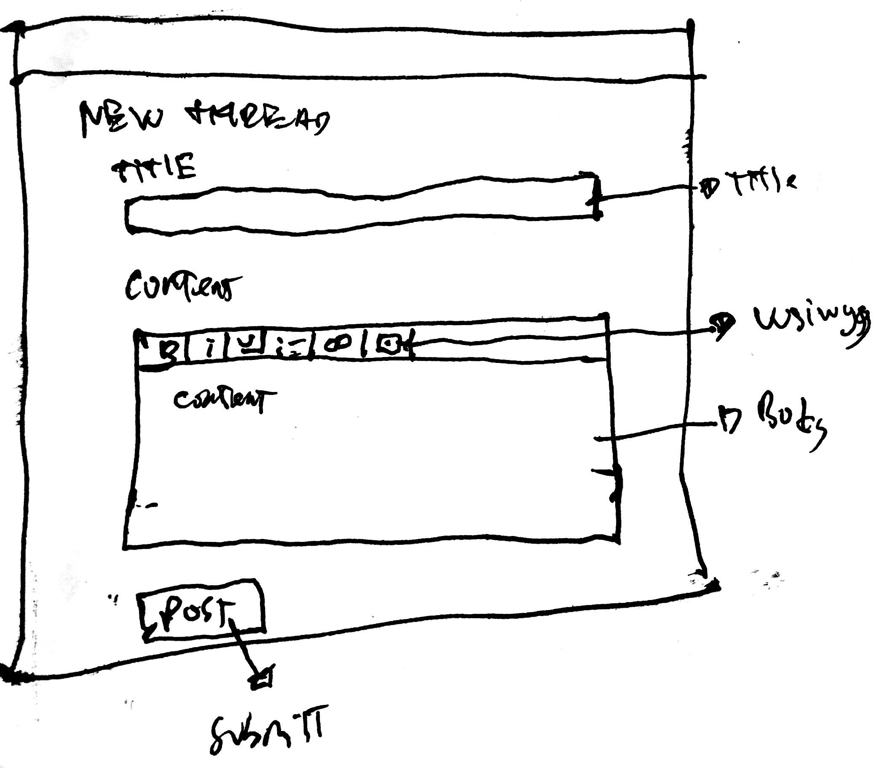
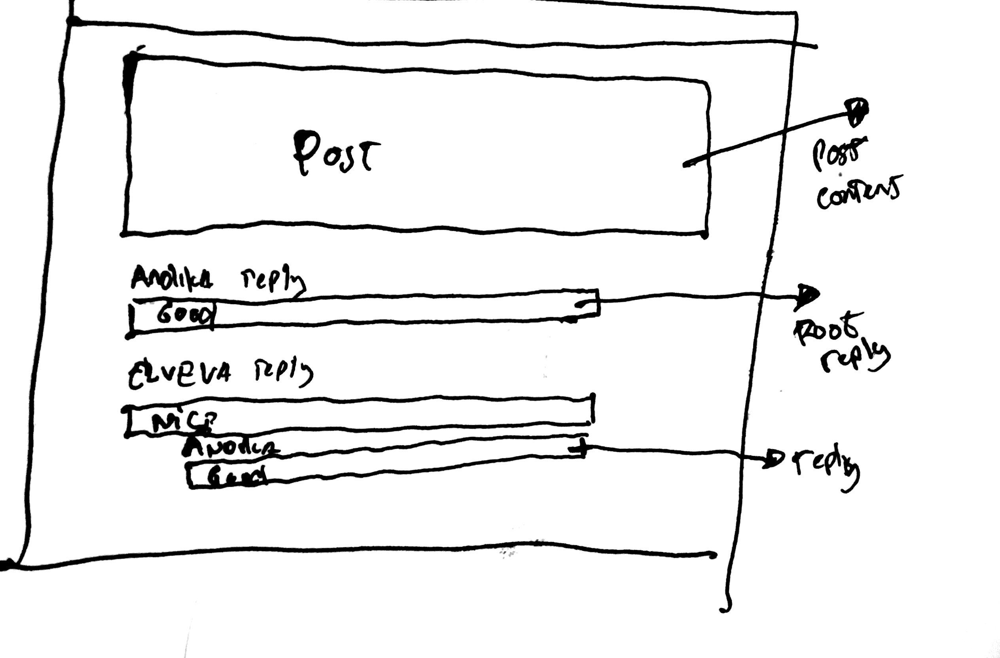

## Prototype

**Design Rationale:**
Our analysis gave us the conclusion that Craiglist forums design is too old school. Many of the UI components are too small which makes it hard to read. Some flow to execute features such as View Threads are different than modern online forums, which causes participants to be unfamiliar.

We decide to create larger UI components representing them in card like forms, raised buttons, strategic layout positions, and clear labels to inform users their situation.

**Sketch 1: Category layout**

**Sketch 2: Rate thread**

**Sketch 3: Compose new thread**

**Sketch 4: Thread layout**

**High Fidelity:**
https://invis.io/2QRXC79APGW#/362338757_4
