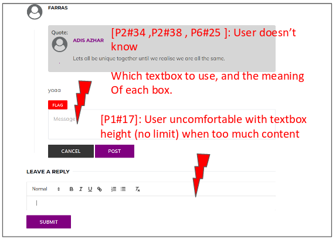
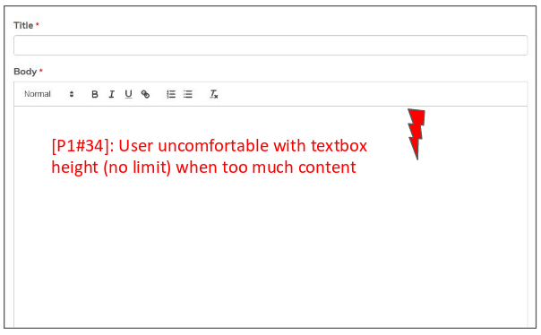
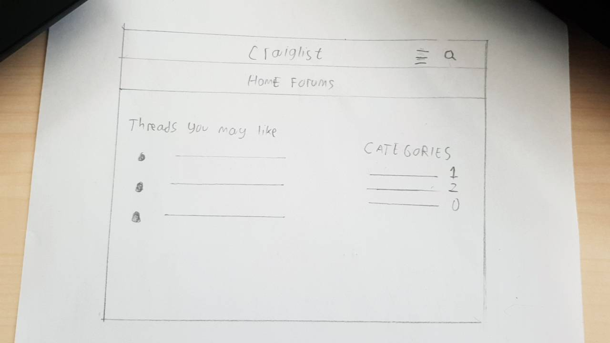
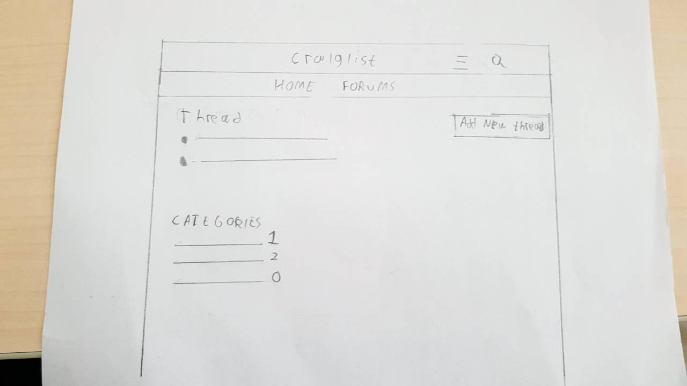
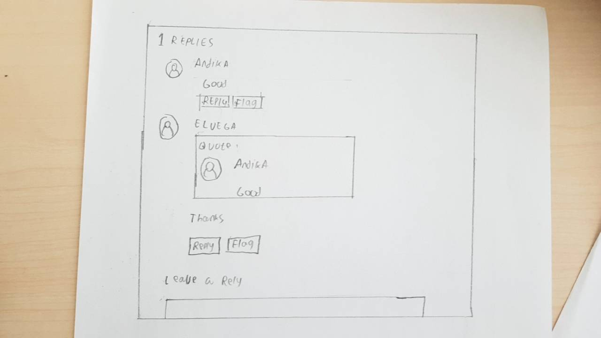

## Operating the Prototype
[](https://youtu.be/a8raFc1unX4)<br>
##### Check Video:

[Video](https://youtu.be/a8raFc1unX4)

### Part A: Usability Evaluation
#### 1. Brief Description of Participants
##### a. Description of Participant 1
- A male, 21 years old.
- A student of ITS Material Engineering.
- He had experienced about using social media.
- More than 3 years have account at online forums.
- Never heard about Craiglist.
##### b. Description of Participant 2 
- ITS Student
- Male, 22 years old
- Have heard of Craiglist secondhand sell and buy feature
- Never heard of Craiglist forums
- Use social media daily
##### c. Description of Participant 3
- A male, 22 years old.
- A student of ubaya
- He had experienced about using social media / forum.
- not realy enjoy socialising
##### d. Description of Participant 4
- A male, 22 years old.
- A student of Hang Tuah Ocean Engineering.
- He had experienced about using social media.
- Never heard about Craiglist.
##### e. Description of Participant 5
- 15 years old, high school student
- Male
- Daily internet user for entertainment purposes (youtube)
- Never heard of Craiglist forum
- Knows Craiglist secondhand sell and buy feature
##### f. Description of Participant 6
- A male, 21 years old.
- A student of ubaya
- He had experienced about using social media / forum.
- Enjoy Using kaskus(Forum Discussion)

#### 2. Preliminary Interview Questions
1. Did you ever use soscial media before?
2. How often you use social media?
3. Are you updated with new trends?
4. Do you like to discuss new ideas?
5. Have you used online discussions? How familiar are you with it?
6. Do you usually discuss something in front of strangers?
7. Do you prefer offline or online discussions?

#### 3. Evaluation Script

1. Try to login.
2. Find the category with the highest number of threads.
3. Search a category.
   - Keyword: Vegan
4. Reply to a thread.
5. Sort the forum
   - Oldest first
6. Rate a thread / reply.
7. Flag a thread / reply.
8. Create a new forum
   - Title: Android Phone
   - Body: Iphone is better than Android
   - City: Choose any


#### 4. Transcript
##### a. Transcript with Participant 1
```
1.  Me  : Halo, sekarang saya meminta tolong anda untuk melakukan uji coba dengan forum Craiglist yang telah kelompok kami buat
2.  Him : Okee
3.  Me  : Sekarang anda login terlebih dahulu seperti biasa menggunakan akun ini (memberikan akun yang telah kami buat sebelumnya)
4.  Him : Oke aku coba dulu,
5.  Me  : Ada masalah?
6.  Him : Nggak ada masalah, fine fine aja
7.  Me  : Oke sekarang anda lihat kategori, lalu cari dengan jumlah thread yang paling tinggi
8.  Him : Ini yang disampingnya itu jumlahnya kan? Kategori 'Fashion' yang paling banyak, ada 2 jumlahnya
9.  Me  : Iya benar, menurut anda bagaimana?
10. Him : Jelas kok, pas aku buka masing2 kategori jumlahnya juga sama persis dengan yang dituliskan
11. Me  : Oke, sekarang kamu cari thread di kategori lifestyle, keywordnya 'Donald Trump' 
12. Him : Ini udah muncul 2 post
13. Me  : Bagaimana menurutmu?
14. Him : Ini baru saja aku liat postnya, dan emang bener ada tulisan Donald trump nya, menurutku sudah akurat pencariannya
15. Me  : Sekarang kamu buka salah satu thread, lalu reply thread itu
16. Him : Thread yang mana?
15. Me  : Apa aja gaapa
16. Him : Oke, ini saya klik yang judulnya 'sunset'
17. Him : Ini sudah saya reply, overall baik-baik saja dan tampilannya menyegarkan, tapi ada 1 hal yang kurang, waktu mengisi reply nya, saya tekan enter enter terus sampai bawah, dan kotaknya juga ikut sampai bawah sekali, lebih baik kalau diberi batasan
18. Me  : Oiya benar, terimakasih sarannya
19. Me  : Sekarang coba kamu urutkan forum dari yang 'older first'
20. Him : Okee sudah, tinggal pilih older first lalu tekan go
21. Me  : Menurut kamu gimana?
22. Him : Biasa sih, mudah digunakan menurutku
23. Me  : Sekarang kamu buka salah satu thread, lalu kamu rate
24. Him : Okee sudah
25. Me  : Ada masalah? bagaimana menurutmu?
26. Him : Tidak ada, cukup unik popupnya setelah klik tombol rate
27. Me  : Sekarang kamu flag thread tersebut
28. Him : Okee tunggu
29. Him : Sudah selesai, dan baik- baik saja
30. Me  : Oke kalu begitu, sekarang kamu buat thread baru, apa saja
31. Him : Okee tunggu
32. Him : (3 menit mengetik) Ini sudah terbuat, judulnya 'pemandangan sore'
33. Me  : Okee bagus wkwk, bagaimana menurutmu pembuatan threadnya?
34. Him : Baik-baik saja, saranku sama seperti saat reply tadi, kotaknya jika diberi batana lebih baik.
35. Me  : Okee terimakasih sarannya, terimakasih juga sudah bersedia mengikuti pengujian craiglist
31. Him : Sama-sama

```
##### b. Transcript with Participant 2
```
1. Me: Ujicoba ini adalah versi baru Craiglist forum. Untuk instruksi pertama, coba anda cari halaman login.
2. Him: Jadi sekarang saya mencet tombol di kanan atas, yang berbentuk seperti buku ditumpuk. Lalu ada komponen yang muncul di kanan. Saya pencet tombol login.
3. Me: Coba login menggunakan email anda, dengan password 123123123 (credentials sudah ada sebelum uji coba).
4. Him: Sudah mengisi, lalu saya mencet tombol login.
5. Me: Apakah ada kesulitan untuk melakukan login?
6. Him: Menurut saya sudah cukup jelas dan tidak ada kesulitan.
7. Me: Instruksi selanjutnya, coba anda cari kategori dengan jumlah thread terbanyak.
8. Him: Maksudnya gimana?
9. Me: Jadi Craiglist itu terdiri dari kategori. Setiap kategori itu ada thread nya, seperti postingan. Cari kategori, dengan jumlah thread terbanyak.
10. Him: Hmmm. Ini, Lifestyle kategori.
11. Me: Kok bisa tahu itu yang terbanyak?
12: Him: Karena disebelah kanannya, ada angka 6. Dibandingkan yang lain, ia yang tertinggi.
13. Me: Coba anda memasuki kategori tersebut untuk mengecek apa benar.
14. Him: Ya ada 6.
15. Me: Anda mengeceknya bagaimana?
16. Him: Jadi di halaman pertama ada 5, lalu di halaman selanjutnya ada 6. Terpisah per halaman ada 5.
17. Me: Menurut anda apakah itu baik untuk memberi limit per halaman?
18. Him: Iya, agar tertata baik, dan tidak rame. Kalo banyak, user seperti saya malas untuk membacanya.
19. Me: Kalau di halaman kategori, apa yang anda lihat?
20. Him: Maksudnya?
21. Me: Jadi kan ada beberapa thread ini. Setiap thread memiliki apa?
22. Him: Ada gambar, di sampingnya ada penjelasan berupa kategori yaitu Technology ini, lalu ada nama yang ngeposting, waktu, serta konten utama. Menurut saya udah cukup untuk menarik perhatian pembaca. Text sudah besar, lokasi tombol tidak sulit untuk dicari.
23. Me: Instruksi selanjutnya, coba menggunakan fitur search. Searching kata "vegan".
24. Him: Ini kategori diisi apa?
25. Me: Pilih salah satu.
26. Him: Ini hasilnya ada 5. (Terjadi kesalahan pada aplikasi, yang tidak mengandung kata vegan tetap muncul).
27. Me: (10 menit kemudian setelah diperbaiki) Ok coba lagi. Jumlahnya ada berapa?
28. Him: Ada 1.
29. Me: Untuk melakukan fitur search apa ada kesulitan?
30. Him: Ndak. Cukup mudah, search bar besar, mudah untuk diketik. Ada dropdown kategori untuk lebih spesifik.
31. Me: Ok. Instruksi selanjutnya, coba anda pilih salah satu thread.
32. Him: Sudah. Di dalamnya ada gambar, judul, kategori, dan body.
33. Me: Sekarang coba untuk reply dan memberi komentar.
34. Him: Ini pilih yang mana?
35. Me: Itu ada dua. Anda bisa memberi reply ke komentar, dan komentar ke thread.
36. Him: Ok sudah.
37. Me: Apa mengalami kesulitan untuk melakukannya?
38. Him: Iya. Saya bingung yang dimaksud. 
39. Me: Instruksi selanjutnya kamu coba flag komentar. Terus centang "others" dan mengisi alasan.
40. Him: Ok. Ini ada tombol merah bertulisan "flag". Ada kotak yang muncul, aku centang... Ada tulisan "Done" dengan logo centang. Berarti ini sudah berhasil.
41. Me: Instruksi selanjutnya, anda bikin thread baru.
42. Him: Ini dimana ya, saya ndak tau tempatnya.
43. Me: Saya kasi hint. Anda harus masuk suatu kategori dahulu.
44. Him: Oh, ini saya masuk kategori Technology. Ada tombol Add New Thread.
45. Me: Coba anda isi dengan text sebagai berikut (ada contoh text yang sudah disiapkan). Gunakan text formatting yang disediakan.
46. Him: Ok, saya gunakan bold dan underline.
47. Me: Apa mengalami kesulitan untuk bikin thread baru?
48. Him: Kesulitan hanya mencari halamannya.
49. Me: Instruksi terakhir, melakukan sorting thread. Mulai dari terbaru dan tertua.
50. Him: Saya masuk tab forums. Ada dropdown "Sort by". Kalau terbaru berarti Newest First, dan tertua Oldest First.
51. Me: Selain itu, anda mengeceknya bagaimana?
52. Him: Ini ada tanggal threadnya. Sudah benar, yang paling atas adalah yang terbaru (newest), dan kalo ini adalah yang tertua (oldest).
53. Me: Baik. Apa merasakan kesulitan untuk sortir?
54. Him: Tidak.
55. Siip. Terima kasih ya!
```

##### c. Transcript with Participant 3
```
1. Me  : Makasih Mas udah meluangkan waktunya buat wawancara prototype terbaru craiglist setelah wawancara pada website craiglist senbelumnya
2. Him : iya mas selow
3.  Me  : mas sekarang coba login id passwordnya ada di notepad
4.  Him : Oke tunggu sebentar
5.  Me  : giamana mas login nya
6.  Him : agak bingung sih mas awalnya soalnya login tidak di halaman utama tapi sebener nya ngga susah di temuin
7.  Me  : Okee, skearang silahkan cari kategori yang memiliki thread paling banyak
8.  Him : yang ini kan mas
9.  Me  : Bagaimana anda tahu?
10. Him : Ada nomer di samping nya itu menunjukkan jumlah tread nya kan?
11. Me  : yup bener sekali susah kah menemukan nya?
12. Him : ngga mas
13. Me  : Sip, sekarang coba anda cari dengan keyword 'Donald Trump'
14. Him : Okee, ini udah tapi not found
15. Me  : mas untuk sistem pencarian nya huruf kecil besar nya harus diperhatikan lagi
16. Him : oalah gitu ternyata
17. Me  : susah kah mas menggunakan nya?
18. Him : ngga sih mas cuma biasanya klo buat forum lebih enak nge discover gitu liat" apa yang menarik. 
17. Me  : Oke sekarang coba mas buka 'Sunset'
18. Him : ok mas , udah ni keren mas
19. Me  : coba sekarang reply tread nya mas
20. Him : dibawah kan mas ini ,udah mas
21. Me  : oke mas sekarang coba ke halam utama lagi.
22. Him : udah mas
23. Me  : nah kan ini dari terbaru ke terlama, coba mas sort by oldest jadi yang terlama dulu
24. Him : Ini udah
23. Me  : menurutmas bagaimana?
24. Him : ini tinggal di sort aja mau gimana , ez mas 
25. Me  : haha , Sekarang mas coba rate thread yang tadi
26. Him : Okee, udah selesai
27. Me  : Bagaimana menurutmu?
28. Him : keliahatan jelas mas , soalnya bentuk nya kaya tombol gitu warna nya beda
29. Me  : wah udah di rate ama flag aja
30. Him : Oiya belum di perintahin ya mas, soalnya tombol nya berdekatan ku kira disuruh sekalian wkwk
29. Me  : iya mas ini saya juga mau nyaranin mas buat ngelakuin itu tapi karna udah mas lakuin jadi yuasudah
33. Me  : sekarang coba mas bikin thread/diskusi baru judulnya Android phone
34. Him : oke mas isinya terserah ya 
35. Me  : iya mas gapapa
37. Him : udah mas lancar
38. Me  : Mas Menurut mas bagaimana craiglist yang sekarang
39. Him : Jelas sih mas, saya yang ngga banyak mengunjungi aplikasi lain juga bisa dengan mudah ngakses nya , yang kemarin tuh horror mas tulisan nya kecil" tampilan nya gajelas haha
40. Me  : iya mas saya disini pingin memperbaiki website tersebut
41. Me  : Makasih ya mas buat waktunya
42 Him  : Oke mas sama" 

```

##### d. Transcript with Participant 4
```
1.  Me  : Selamat malam, sekarang saya meminta tolong anda untuk melakukan uji coba dengan forum Craiglist yang telah kelompok kami buat
2.  Him : Malam
3.  Me  : Sekarang anda coba login menggunakan akun berikut (memberikan akun yag telah dibuat sebelumnya)
4.  Him : Oke tunggu sebentar
5.  Me  : Bagaimana loginnya? bagaimana tanggapanmu?
6.  Him : Seperti login pada umumnya sih, tidak ada masalah, cuma mencari loginnya butuh penyesuaian, karena ada pada sidebar
7.  Me  : Okee, skearang anda berada pada halaman awal, silahkan cari kategori yang memiliki thread paling banyak
8.  Him : Hmm sepertinya kategori fashion (?)
9.  Me  : Bagaimana anda tahu?
10. Him : Disampinya ada nomor, kemungkinan itu jumlah threadnya, apa benar?
11. Me  : Iya, berarti sudah jelas ya? silahkan dicek apakah sudah benar jumlahnya sesuai nomor tersebut?
12. Him : Okee, udah sama kok, fashion ada 2, lifestyle ada 1
13. Me  : Sip, sekarang coba anda cari dengan keyword 'Donald Trump'
14. Him : Okee, ini udah muncul
15. Me  : Silahkan dicek, apa sudah sesuai, dan bagaimana tanggapanmu?
16. Him : Udah sesuai kok, ada kalimat donald trumpnya, menurutku sih udah pas dan sesuai, tapi misal saya ketik donald trimp gabakalan muncul ya?
15. Me  : Tidak, silahkan dicoba 
16. Him : Oiya tidak muncul
17. Me  : Oke sekarang anda coba reply sebuah thread
18. Him : Ini aku reply thread 'pemandangan sore'
19. Me  : Bagaimana menurutmu?
20. Him : Baik-baik aja sih, enak juga liat popunya
21. Me  : Oke makasih, sekarang kamu buka forum dan sort by oldest 
22. Him : Ini udah, cepet ya wkwk
23. Me  : Wkwk, menurutmu bagaimana?
24. Him : Ya tinggal pilih aja, mudah dioperasikan kok 
25. Me  : Sekarang kamu coba rate thread atau reply
26. Him : Okee, ini aku rate thread yang tadi ya, udah selesai
27. Me  : Bagaimana menurutmu?
28. Him : Mudah kok, tinggal klik, dan nyarinya juga gampang, warnanya beda, ini ada flag juga sebelahnya
29. Me  : Hmm sekarang kamu coba rate
30. Him : Udah kok wkwk, lancar
31. Me  : Yaudah kalo lancar, gaada tambahan?
32. Him : Udah kok, sama seperti flag tadi
33. Me  : Nah sekarang kamu coba buat thread baru
34. Him : Okee, ini aku buat thread kategori travel
35. Me  : Bagaimana menurutmu?
31. Him : Sama kayak bikin post di medsos sih, mudah dan nyaman buat dioperasikan
32. Me  : Oke, makasih ya udah bersedia buat ikut percobaan tentang Craiglist
33. Him : Okes santai
```

##### e. Transcript with Participant 5
```
1. Me: Coba sekarang kamu login dengan akun yang saya sediakan ini.
2. Him: Oh ini Craiglist... Sudah login.
3. Me: Apa mengalami kesulitan?
4. Him: Ndak. Tinggal mengisi username dan password.
5. Me: Ok. Sekarang kamu cari kategori dengan post terbanyak. Kategori apa?
6. Him: (Diam sejenak) Ehh lifestyle.
7. Me: Ada berapa?
8. Him: 6.
9. Me: Kok tau ada 6?
10. Him: Di samping kanan ada angkanya.
11. Me: Ok coba kamu liat post nya apa saja. Terus cek apa benar ada 6.
12. Him: Halaman ini ada 5. Next... ada 1. Ada 6 total. Halamannya ada 2.
13. Me: Apakamu mengalami kesulitan untuk mencari jumlah post per kategori?
14. Him: Ndak. Mudah kok.
15. Me: Menurutmu apa perlu per halaman hanya ada 5?
16. Him: Iya. Biar ndak terlalu scroll panjang ke bawah.
17. Me: Sekarang cari search bar. Terus search "vegan".
18. Me: Berapa result yang kamu temukan?
19. Him: 1
20. Me: Apakah mengalami kesulitan untuk mencari search?
21. Him: Ndak. Karena ada didepan mata dan setiap halaman ada icon search.
22. Me: Menurutmu berguna ndak?
23. Him: Iya. Karena membantu untuk mencari post yang aku tertarik.
24. Me: Sekarang kamu masuk ke suatu thread. Terus beri komentar.
25. Him: Ini dibaca dulu?
26. Me: Ndausah gapapa. Apa sudah menemukan section komentar?
27. Him: Sudah. Ada dibawah.
28. Me: Coba kamu beri komentar terus di format text nya.
29. Him: Udah. Ini aku underline. Biar keliatan penting.
30. Me: Ok. Mudah kah?
31. Him: Mudaah.
32. Me: Ok. Sekarang kamu sorting post.
33. Him: Gimana caranya?
34. Me: Coba di explore dulu.
35. Him: Ok udah. Ini aku pencet Newest First.
36. Me: Coba cek apa tanggalnya sudah benar?
37. Him: Loh ini beda. Tanggalnya campur-campur, ndak urut.
38. Me: Oh ya, ada kesalahan itu. Lanjut aja ya.
39. Me: Instruksi selanjutnya, kamu masuk ke suatu  thread. Terserah yang mana. Terus flah postnya.
40. Him: Udah. AKu centang apa?
41. Me: Hmmm "hate speech".
42. Him: Muncul teks Done dengan logo centang hijau.
43. Me: Ok. Sekarang bikin post baru.
44. Him: Gimana caranya?
45. Me: Ya cari dulu.
46. Him: (setelah mencari di setiap halaman) Ahhh. Ini ada tombolnya. Aku isi apa?
47. Him: Loh gabisa mas.
48. Me: Kamu isi semuanya.
49. Him: Yaa sudah.
50. Me: Coba buka yang kamu post...
51. Him: Loohh Not found...
52. Me: Oh yaudah. Makasih yaa, udah selesai!
```
##### f. Transcript with Participant 6
```
1.  Me  : Makasih Mas udah meluangkan waktunya buat wawancara
2.  Him : iya mas emang lagi luang kok
3.  Me  : mas saya tunjukan dulu aplikasi yang telah saya buat
4.  Him : Bagus mas tampilan nya ini mas beneran yang bikin
5.  Me  : Iya mas hehe
6.  Me  : Coba mas sekarang login id password nya ada di notepad
7.  Him : Oke tunggu sebentar
8.  Me  : giamana mas login nya
9.  Him : agak bingung sih mas awalnya tapi di atas kaya ada tombol buat extend ternyata disitu
10. Me  : Okee, sekarang silahkan cari kategori yang memiliki thread paling banyak
11. Him : yang ini kan mas
12. Me  : Bagaimana anda tahu?
13. Him : ini ada nomer nya
14. Me  : Jelas ya mas berarti itu untuk jumlah thread nya
15. Him : iya mas
16. Me  : Sip, sekarang coba anda cari dengan keyword 'Donald Trump'
17. Him : Okee, ini udah tapi not found
18. Me  : mas untuk sistem pencarian nya huruf kecil besar nya harus diperhatikan lagi
19. Him : oalah gitu ternyata
20. Me  : susah kah mas menggunakan nya?
21. Him : agak susah sih mas sebenrnya klo harus sama kalimat nya, tapi ngga ada masalah 
22. Me  : Oke sekarang coba mas buka Thread 'Sunset'
23. Him : ok mas , ada pop up nya mas baguss
24. Me  : iya mas makasih
25. Me  : coba sekarang reply tread nya mas
26. Him : oke mas bentar ya
27. Me  : Menurut mas gimana untuk komen nya
28. Him : agak bingung mas soalnya ada 2 kotak kosong tadi tapi karna biasanya yang bawah say pilih yang bawah
29. Me  : oke mas sekarang coba ke halam utama lagi.
30. Him : udah mas
31. Me  : nah kan ini dari terbaru ke terlama, coba mas sort by oldest jadi yang terlama dulu
32. Him : Ini udah
33. Me  : menurutmas bagaimana?
34. Him : keliatan kok mas tombol sortnya ada di atas jadi ngga susah
35. Me  : oke mas coba sekarang mas buka thread tadi terus rate thread nya
36. Him : Okee, udah selesai
37. Me  : Bagaimana menurutmu?
38. Him : keliahatan jelas mas , soalnya bentuk nya kaya tombol gitu warna nya beda
39. Me  : oke mas serkarang coba mas flag
40. Him : oke mas udah btw flag itu buat apa I?
41. Me  : Buat nandain aja sih mas sebenernya
42. Me  : Bagaimana Pendapat nya soal website tadi
43. Him : Bagus sih mas agak mirip ama kaskus tapi ini lebih jelasss, saya juga suka ama tampilan nya
44. Me  : Makasih ya mas
45 Him  : Oke mas

```

#### 4. Feedback and Incidence Analysis
Example:
P9#21: Participant 9, line 21

##### Observation 1 (Login)


**Reference:**
P1#6: fine fine aja
P4#6: Seperti login pada umumnya 
P2#6: Menurut saya sudah cukup jelas dan tidak ada kesulitan.
P5#4: Ndak. Tinggal mengisi username dan password.
**Feedback:**
P2: Login is clear to use, self explanatory and user doesn’t have difficulty using it.
P5: Easy to use. Just fill in username and password.
**Incidence:** -
**Reason:** -
**Resolution:** -

##### Observation 2 (Category with highest threads part 1)


**Reference:**
P1#10: Jelas kok, pas aku b…
P3#10: Ada nomor di sebelah nya..
P4#12: Okee, udah sama kok
**Feedback:**
P1: Positive
P3: Positive
P4: Positive
**Incidence:** -
**Reason:** -
**Resolution:** -

##### Observation 3 (Category with highest threads part 2)


**Reference:** 
P2#18: Iya, agar tertata baik, dan tidak rame. Kalo banyak, user seperti saya malas untuk membacanya
P5#16: Iya. Biar ndak terlalu scroll panjang ke bawah.
**Feedback:** 
P2: Pagination helps by keeping the page tidy, by not crowding the page with text.
P5: Post limit per page useful so the scroll down isn’t long.
**Incidence:** -
**Reason:** -
**Resolution:** -


##### Observation 4 (Search)


**Reference:**
P2#26: Ini hasilnya ada 5. (Terjadi kesalahan pada aplikasi, yang tidak mengandung kata vegan tetap muncul).
P2#30: Cukup mudah, search bar besar, mudah untuk diketik. Ada dropdown kategori untuk lebih spesifik.
P5#21: Ndak. Karena ada didepan mata dan setiap halaman ada icon search.
P5#23: Iya. Karena membantu untuk mencari post yang aku tertarik.

**Feedback:**
P2: the search bar is big, so it’s easy to type the keywords. The category dropdown helps to focus on a specific domain.
P5: Each page has search icon so it’s easy.
P5: Useful to find posts I’m interested in

**Incidence:**
P2: search results wrong

**Reason:**
System unable to search given keywords accurately

**Resolution:** 
Fix the keywords search by title and body

##### Observation 5


**Reference:** 
P1#17: ...dan kotaknya juga ikut sampai bawah sekali
P2#34: Ini pilih yang mana?
P2#38: Iya. Saya bingung yang dimaksud.
P6#28: Agak bingung ama kotaknya

**Feedback:**
P1: Don't feel comfortable with the textbox.
P2: Confuse which textbox to use.

**Incidence:**
P1: Height have no height limit
P2: Doesn’t know which textbox to use

**Reason:**
P1: Textbox doesn't have max height.
P2: 2 textboxes available in the comment section.

**Resolution:**
Give max height on textbox.
Provide a single textbox.


##### Observation 6 (Create new thread part 1)


**Reference:**
P2#42:Ini dimana ya, saya ndak tau tempatnya.
P5#51: Loohh Not found...

**Feedback:**
P2: Add New Thread button was hard to find.
P5: Couldn’t open the created post

**Incidence:**
P2: Doesn’t know where Add New Thread button was.
P5: System gave a Not Found error

**Reason:**
P2: Add New Thread button was nested inside the category page.
P5: Wrong url

**Resolution:**
P2: Give Add New Thread link in each page.
P5: Fix URL for newly created post


##### Observation 7 (Create new thread part 2)


**Reference:**
P1#34: ...dan kotaknya juga ikut sampai bawah sekali
P4#31: mudah dan nyaman buat dioperasikan

**Feedback:**
P1: Don't feel comfortable with the textbox.
P4: Positive
P4: Participant easy to operate

**Incidence:**
P1: Height have no height limit

**Reason:**
P1: Textbox doesn’t have max height.

**Resolution:**
Give max height on textbox.

##### Observation 8 (Sort)


**Reference:**
P2#52:Ini ada tanggal threadnya. Sudah benar, yang paling atas adalah yang terbaru (newest), dan kalo ini adalah yang tertua (oldest).
P5#37: Loh ini beda. Tanggalnya campur-campur, ndak urut.

**Feedback:**
P2: No difficulty in sorting. The date on each thread can be used to know how “fresh” the thread is.
P5: The date order is mixed.

**Incidence:**
P5 Sorting didn’t work because the post results are not sorted, evident by looking at the dates

**Reason:**
Sorting query wrong

**Resolution:**
Fix sorting query

### Part B: Prototyping
##### Sketch
##### Home

##### Categorize

##### Thread

##### Textbox limit

##### Reply Thread

##### comment

##### Design Rationale
From the evaluation, some of the users that participated had trouble with: 
- wrong search results
- height of wysiswig editor
- multiple textarea in the comment section
- hard to reach New Thread button
- wrong sort results

Therefore to act on the troubles mentioned above, our redesigned prototype will have a maximum textarea height, single textarea in the comment section, and New Thread link on each page.

##### High-Fidelity Interactive-Prototype
**Check video :**
[Video](https://youtu.be/tZZRullgH18)
