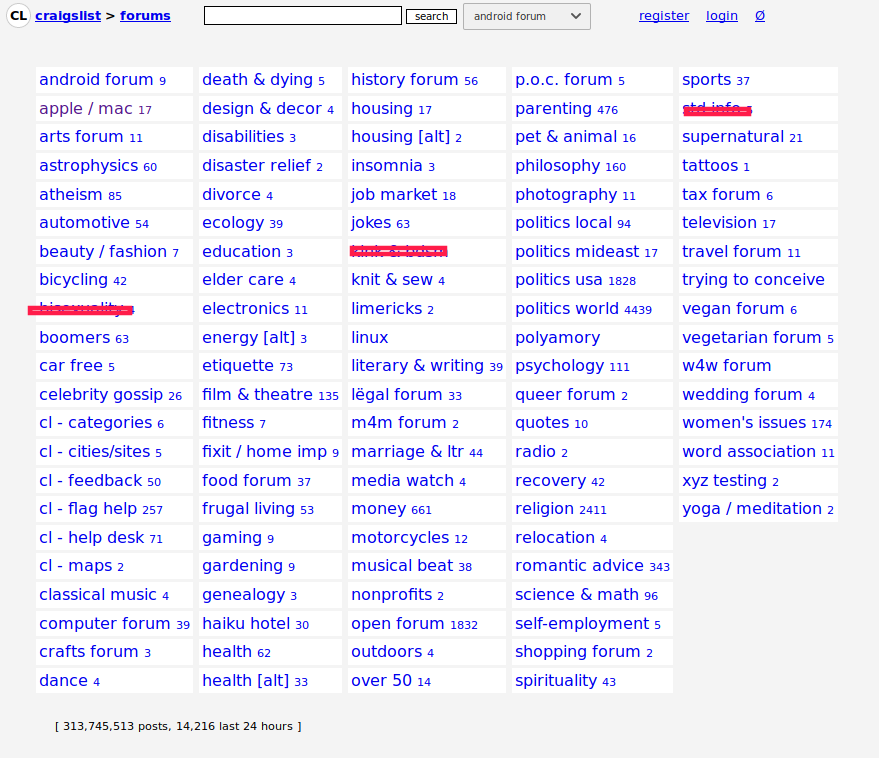
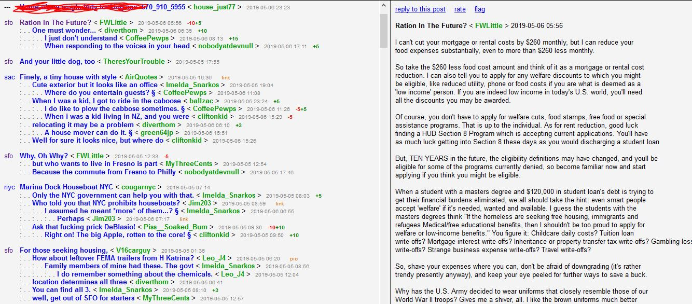

## Anggota kelompok

1. Andika Andra - 0511164000005
2. Adistya Azhar - 05111640000103
3. Elvega Dewangga - 05111640000149

---
## Project Topic : Craiglist Forum Session


Craigslist is an American classified advertisements website with sections devoted to jobs, housing, for sale, items wanted, services, community service, gigs, résumés, and discussion forums.

**Craiglist** [Forum Session](https://forums.craigslist.org/?areaID=157)

#### System Description
Craiglist is one of the rare sites on the interweb where its platform doesn't sell advertisements. The site is purely run for non-profit reasons given to the community, so they are able to enjoy their rights. Most of what Craiglist offer are second hand product listings. Other than that, they have a forum/ thread section, where Users can enjoy a free democratic discussion about anything. Craiglist's system requires a registered account to access its core features.

#### What's Bad About The Existing System
It's obvious to the eyes that Craiglist's user interface isn't pleasing. It's dull, boring, and it seems they don't have a designer to sort it out. Our team has analysed the forum/ thread section activities.

#### What do we think about forums?
Online forums is a place of discussion. Where people can hold conversation in the form of posted messages. The messages are often longer than one line of text, which differs from chat messages. Discussions should be easily identifiable e.g. which person is talking to which person, or which comment is being replied etc.

##### How Craiglist's forum is below standards?



*Image 1.1: The categories label can be a bit more stylish. Categories that are explicit should not be made public, we censored it with a red line.*

----


*Image 1.2: Forum reply created in a tree style, this style is less efficient and not elegant when the thread has a lot of replies.*

## Contextual Inquiry
### Instruction Script
#### Preliminary Interview Questions
1. Did you ever use soscial media before?
1. How often you use social media?
1. Are you updated with new trends?
1. Do you like to discuss new ideas?
1. Have you used online discussions? How familiar are you with it?
1. Do you usually discuss something in front of strangers?
1. Do you prefer offline or online discussions?

#### Specific Instructions
1. Try to Login.
1. Find the category with the highest number of threads.
1. Search a category.
1. Reply to a thread.
1. Sort the forum  to older frist.
1. Rate a thread / reply.
1. Flag a thread / reply.
1. Create a new forum.

#### User Description

##### Participant 1


- A male, 21 years old.
- A student of ITS Industrial Engineering.
- He had experienced about using social media / forum.
- He several times asking about his academic problem/question academic to the internet.

##### Transcript 1
=======
##### Participant 2

##### Participant 3
- A male, 21 years old.
- A student of ubaya
- He had experienced about using social media / forum.
- not realy enjoy socialising
##### Participant 4

##### Participant 5

##### Participant 6- A male, 21 years old.
- A male, 21 years old.
- A student of ITS
- He had experienced about using social media / forum.
- He several times asking about his academic problem/question academic to the internet
```
1.  Me  : Halo, terimakasih sebelumnya sudah mau bergabung dalam wawancara kali ini
2.  Him : Sama-sama
3.  Me  : Baiklah saya mulai, Apakah kamu pernah menggunakan social media sebelumnya?
4.  Him : Pernah, saya juga memiliki beberapa sosial media seperti Instagram, Twitter, Facebook
5.  Me  : Seberapa sering kamu menggunakan sosial media?
6.  Him : Hmm sangat sering sih, hampir setiap saat sepertinya
7.  Me  : Apa kamu mengetahui berita atau trend terbaru?
8.  Him : Saya cukup sering membaca-baca berita dan membaca hal-hal baru tetapi tidak terlalu rinci, hanya hal yang membuat saya tertarik saja
9.  Me  : Apa kamu tertarik untuk mendisuksikan ide-ide baru?
10. Him : Tidak terlalu tertarik dengan seperti itu, tergantung dengan siapa saya akan berbicara
11. Me  : Apa kamu pernah berdiskusi online? seberapa mengerti anda tentang hal itu?
12. Him : Saya cukup sering berkomentar dan berdiskusi pada post-post di media sosial, pernah juga pada kaskus, jadi cukup familiar mengenai hal tersebut
13. Me  : Apa anda pernah berdiskusi dengan orang yang tidak anda kenal?
14. Him : Jika berdiskusi secara langsung mungkin belum pernah, tetapi di media sosial saya berdiskusi dengan orang lain cukup sering
15. Me  : Anda lebih baik berdiskusi secara online atau secara langsung?
16. Him : Sepertinya lebih menyenangkan secara langsung secara pribadi
17. Me  : Oke terimaksih, sekarang saya meminta bantuan anda untuk mencoba web berikut .. (menunjukkan craiglist)
18. Him : Oke
19. Me  : Coba anda login terlebih dahulu (login menggunakan akun saya)
20. Him : (kurang lebih 2 menit berikutnya) saya tidak bisa menemukan tombol untuk loginnya
21. Him : Oh ternyata ada, harus tekan tombol 'my account' terlebih dahulu
22. Me  : Oke, sekarang anda menuju bagian forum, lalu cari category yang memiliki jumlah thread paling banyak
23. Him : (3 menit mencari) yang paling banyak adalah category open forum dengan jumlah 1668 thread
24. Me  : Sekarang coba kamu cari kategori pada forum, kategorinya adalah "housing" dan "quotes"
25. Him : (Menunggu 3 menit), ini sudah ketemu semua, mencarinya agak susah karena jarak antar kategori terlalu dekat dan warnanya hampir sama dengan background webnya
26. Me  : Sekarang kamu coba buka salah satu thread/reply yang ada dalam kategori housing, lalu coba kamu reply
27. Him : Oke, tunggu sebentar
28. Him : Ini udah aku reply thread ' Apartment for sale - What is reasonable access? < westtcoastgal >'
29. Me  : Bagaimana menurutmu?
30. Him : Sejujurnya aku kurang suka sama tampilannya, kurang menarik, dan juga aku mbayangin misal aku ngereply dari reply punya user lain, bakalan jadi panjang itu
31. Me  : Iya, memang seperti itu. Lanjut, sekarang coba kamu urutin threadnya berdasarkan 'older first' 
32. Him : (5 menit mencari tidak menemukan) aku nyerah, nggak menemukan caranya
33. Me  : Haha, coba kamu scroll terus sampai kebawah, itu ada checklist kecil 'older first'
34. Him : Oiya, baru tau aku, harunya kan seperti itu ada di atas
35. Me  : Mungkin seperti itu, sekarang coba kamu rate thread yang tadi
36. Him : Oke, gaada masalah si, cuma ya tampilannya itu yang ngebosenin
37. Me  : Coba kamu flag thread/reply, flag ini semacam fitur report
38. Him : Oke sudah, caranya hampir sama seperti pada web-web lainnya sih, tidak ada perbedaan yang menonjol
39. Me  : Nah, sekarang coba kamu buat thread baru
40. Him : Buat baru ini?
41. Me  : Iya, untuk topiknya terserah
42. Him : Oke tunggu
43. Him : Udah terbuat, cukup rumit juga ngebikinnya, tapi masih wajar sih dan juga judulnya gaboleh terlalu panjang juga
44. Me  : Iya biar ga terlalu panjang ke kanannya
45. Me  : Ini udah selesai, makasih banyak atas waktunya.
46. Him : Sama sama
```


##### Participant 2

##### Transcript
```
1. Me: Terima kasih sudah menyediakan waktunya untuk mengikuti uji coba aplikasi Craiglist.
2. Me: Sebelumnya sudah pernah dengar atau menggunakan Craiglist?
3. Him: Belum pernah.
4. Me: Jadi Craiglist adalah aplikasi jual - beli barang bekas, dan juga forum diskusi. Yang akan saya ujicoba kan adalah forum diskusinya.
5. Me: Saya ada beberapa pertanyaan disini. Yang pertama adalah apakah anda pengguna sosial media yang aktif?
6. Him: Iya
7. Me: Per hari kira-kira menghabiskan waktu berapa jam?
8. Him: 5 - 6 jam lewat HP.
9. Me: Apakah anda update dengan tren saat ini. Mungkin tentang tekonologi, politik, atau hobby?
10: Him: Tidak terlalu sih.
11. Me: Anda suka berdiskusi hal baru?
12: Him: Iya senang.
13: Me: Anda pernah menggunakan online forum discussion?
14: Him: Jarang sih.. Ndak pernah sih.
15. Me: Kalau jarang berarti ndak familiar ya? Mungkin bisa nyebutin yang pernah anda dengar.
16. Him: Hmm Kaskus mungkin.
17. Me: Pernah mengakses kaskus?
18. Him: Udah lama sekali ndak baca.
19. Me: Baik sekarang didepan anda ada laptop saya, saya persilahkan untuk anda operasikan. Instruksi pertama, saya akan meminta anda untuk mencari menu forum.
20. Him: Forum di web ini? Ini disucssion forum...
21. Me: Sekarang anda berada di halaman apa? Dan bisa melihat apa saja?
22. Him: Ada bermacam-macam kategorinya, yang bahas topic tersendiri.
23. Me: Menurut anda, apakah desainnya memuaskan?
24. Him: Tidak sih... Terlalu simple.
25. Me: Dengan desain seperti ini, anda ingin melanjutkan menggunakan aplikasi ini?
26. Him: Kalau bener-bener butuh iya.. Tapi kalau dipaksa enggak.
27. Me: Sekarang untuk instruksi selanjutnya adalah untuk mencari Kategori dengan Thread terbanyak.
28. Him: Kalau dilihat siih... Ini ada yang 500 dengan kategori Parenting. Eh tapi ada yang lebih banyak lagi ternyata. 7000 threads Politics World.
29. Me: Anda kok tahu bahwa kategori tersebut memiliki thread tertinggi?
30. Him: Anda angka disampingnya.
31. Me: OK, coba sekarang anda mencari kategori dengan jumlah thread 1 - 5.
32. Him: Ini aku pilih Dance, dia ada 2. Hmm sekarang aku ada di halaman Dance tetapi jumlah threadnya lebih besar dari 2. Ada lebih dari 10 bahkan. Berarti angka yang ada di halaman sebelumnya tidak akurat.
33. Me: Apa kesulitan yang anda rasakan ketika mencari jumlah thread?
34. Him: Yaa lumayan bingung sih. Merasa tertipu. Seharusnya label jumlah thread harus akurat.
35. Me: Instruksi selanjutnya, saya kan search Kategori. Coba search dengan kata "Donald Trump".
36. Him: Okay.. Saya sedang mengetik di kolom search Donald Trump.
37. Him: Hmm tidak ada hasilnya, "No post containing" yang muncul.
38. Me: Instruksi selanjutnya, coba masuk salah satu kategori yang anda sukai.
39. Him: Ok... Ini tentang Jokes.
40. Me: Anda coba sortir thread mulai dari yang tertua.
41. Him: *1 minute looking for the sort button*
41. Me: Apakah sudah disortir?
42. Him: Sudaah, tadi saya cari-cari ternyata ada di bawah.
43. Me: Okay, instruksi selanjutnya, anda reply suatu thread. Mengisi title dan body text.
44. Him: Okay sudah.
45. Me: Coba cari reply anda di halaman tersebut.
46. Him: Hahaha dimana ini, lumayan sulit reply nya saling tertumpuk atas-bawah. Kalau saya klik thread nya kok ndak muncul reply dibawah langsung ya? 
47. Me: Apa anda mengalami kesulitan untuk menemukan reply?
48. Him: Iya, desain reply terlalu ramai. Dan tidak muncul reply dibawah. Desainnya kurang bagus.
49. Me: Menurut anda yang bagus seperti apa?
50. Him: Kalau kita reply seharusnya langsung muncul dibawah.
51. Me: Oh okay okay.


```

##### Participant 3

##### Transcript
```
[00:00] Me  : Mas Pernah pake sosial media ngga sebelumnya
[00:06] Him : Pernah
[00:10] Me  : Seberapa sering mas menggunakan nya
[00:13] Him : biasanya kalau ada waktu kosong sih
[00:31] Me  : update ngga dengan trend trend yang ada
[00:36] Him : ngga sih
[00:41] Me  : suka ngga mendiskusikan ide" baru
[00:49] Him : ngga terlalu
[01.01] Me  : Pernah pake diskusi online ngga sebelumnya 
[01.16] Him : biasanya sih cuman baca aja ngga ikut komen , tapi sering buka sih
[01.30] Me  : pernah ngga berdiskusi dengan orang yang mas belum kenal sebelumnya
[01.40] Him : Belum pernah
[02.11] Me  : lebih suka diskusi online apa offline
[02.21] Him : tergantung ada waktu atau ngga, klo lagi kosong enakan ketemuan
[02.35] Me  : (explain what is craiglist forum and that what we need is to review the aplication not the user)
[02.56] Me  : coba sekarang mas login
[03.01] Him : (he could find login button without any problem)
[03.35] Me  : coba mas cari kategori dengan diskusi paling banyak
[03.37] Him : (trying to search it one by one, take a long time ) 
[04.23] Me  : oke setelah itu coba cari kategori tadi di search bar
[04.30] Him : (easly find it but there are no result)
[05.01] Me  : coba buka kategori terus balas diskusi nya
[05.12] Him : (cant find the reply button)
[06.01] Me  :  sekarang kan diurutkan dari yang paling baru, coba urutkan dari yang paling lama
[06.08] Him : (changing the page)
[06.30] Me  : (telling that what he did was changing the page not sort it , ask him to find another button)
[06.35] Him : gangerti bingung (cant find the sort button)
[07.01] Me  : kasih rate diskusi tersebut
[07.10] Him : hahaha (just laughing but cant find the rate button)
[07.31] Me  : kasih flah diskusi tersebut
[07.35] Him : tetep ganemu hahaha
[08.05] Me  : ngapapa santuy , sekarang bikin diskusi baru
[08.09] Him : (he cant find the button)
```

##### Participant 4
- A female, 20 years old.
- A student of ITS Chemical Engineering.
- He had experienced about using social media but not forum type.
- Updated about new trends.
##### Transcript
```
1.  Me  : Halo, Apakah anda pernah menggunakan media sosial sebelumnya?
2.  Her : Pernah, juga menggunakan beberapa media sosial
3.  Me  : Seberapa sering anda menggunakannya?
4.  Her : Sangat sering, setiap saat
5.  Me  : Apakah kamu mengetahui berita dan trend terbaru?
6.  Her : Cukup mengetahui, tetapi hanya pada tema tema tertentu saja
7.  Me  : Apakah kamu menyukai mendiskusikan hal hal baru?
8.  Her : Tidak juga, tergantung topiknya
9.  Me  : Apakah kamu pernah berdiskusi secara online?
10. Her : Tidak pernah, saya hanya membaca saja
11. Me  : Apakah kamu biasanya berdiskusi dengan orang yang tidak anda kenal?
12. Her : Tidak pernah
13. Me  : Lebih baik berdisukusi secara online atau secara langsung?
14. Her : Sepertinya lebih baik secara langsung agar tidak salah paham
15. Me  : Oke, sekarang ke pertanyaan selanjutnya, Anda coba buka website berikut (menunjukkan craiglist dan memberikan gambaran umum)
16. Her : Oke
17. Me  : Anda coba login menggunakan akun berikut
18. Her : Oke sudah
19. Me  : Sekarang coba anda cari kategori dengan jumlah thread terbanyak
20. Her : (3 menit mencari), ini kategori politics world dengan jumlah 6878
21. Me  : Sekarang anda coba cari kategori "Sports"
22. Her : Oke ini udah ketemu
23. Me  : Sekarang anda buka salah satu thread/reply, dan coba untuk reply thread/reply tersebut
24. Her : (Kesulitan untuk menemukan tombol reply)
25. Me  : Sekarang coba anda mengurutkan thread berdasarkan "older post"
26. Her : (Tidak dapat menemukan fitur tersebut), saya tidak dapat menemukan fiturnya
27. Me  : Iya, tombolnya ada di bagian paling bawah
28. Her : Oalah iya
29. Me  : Sekarang Rate thread/reply tersebut
30. Her : Oke (tidak ada masalah)
31. Me  : Lalu Flag thread/reply tersebut
32. Her : Oke sudah (tidak ada masalah)
33. Me  : Setelah itu coba buat thread baru
34. Her : (Setelah beberapa saat tidak ada masalah) ini sudah bikin thread baru
35. Me  : Oke terimakasih atas bantuannya
36. Her : Sama-sama
```


##### Participant 5

##### Transcript
```
todo: Ha
```

##### Participant 6

##### Transcript
```
[00:00] Me  : pernah pake sosial media sebelumnya?
[00:06] Him : pernah
[00:08] Me  : seberapa sering mas make nya?
[00:10] Him : setiap hari
[00:18] Me  : update ngga dengan trend" yang ada?
[00:21] Him : ngga terlalu
[00:27] Me  : suka ngga mendiskusikan ide" yang mas pikirin saat ini?
[00:34] Him : ngga, ide aja jarang mas
[00.41] Me  : pernah join ke forum diskusi online ngga sebelumnya?
[01.04] Him : pernah
[01.16] Me  : biasa ngga berdiskusi dengan orang yang sebelumnya masbelum kenal
[01.31] Him : biasanya kalo butuh aja sih
[01.43] Me  : lebih suka diskusi online apa offline
[01.48] Him : tergantung ada waktu atau tidak
[01.57] Me  : (explain what is craiglist forum and that what we need is to review the aplication not the user)
[02.30] Me : coba sekarang mas login
[02.35] Him  : (he could find login button without any problem)
[03.15] Me  : cari kategori dengan jumlah diskusi paling banyak
[03.25] Him : (trying to search it one by one, take a long time ) 
[03.47] Me  : search kategori tadi
[03.55] Him : (easly find it but there are no result)
[04.15] Me  : coba buka diskusinya lalu 
[04.18] Him : (Take a long time to find it)
[05.25] Me  : coba rate diskusinya
[05.28] Him : (easily find it)
[05.35] Me  : coba flag diskusinya
[05.43] Him : (easily find it )
[05.52] Me  :  sekarang kan diurutkan dari yang paling baru, coba urutkan dari yang paling lama
[05.55] Him : (wrong answer : changing the page)
[06.30] Me  : make new forum
[06.47] Him : (he can find the button)
```